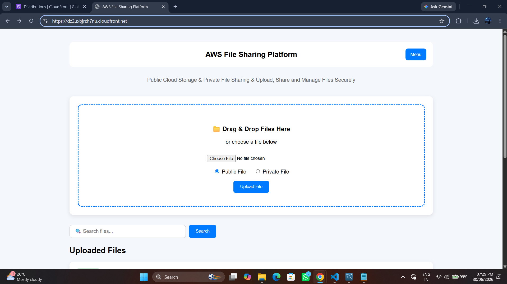
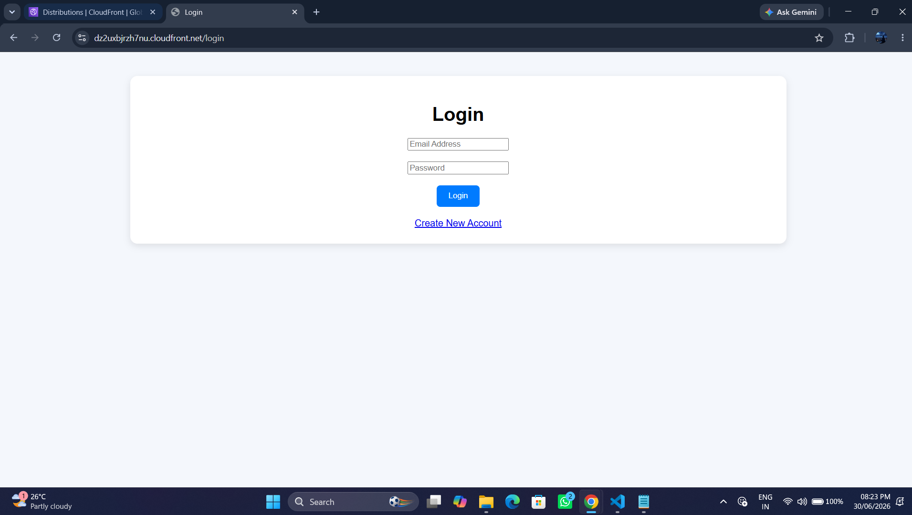
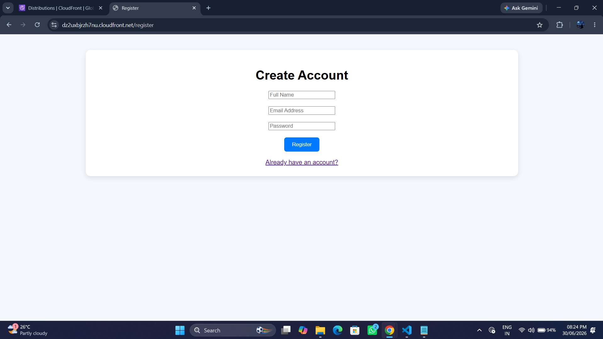
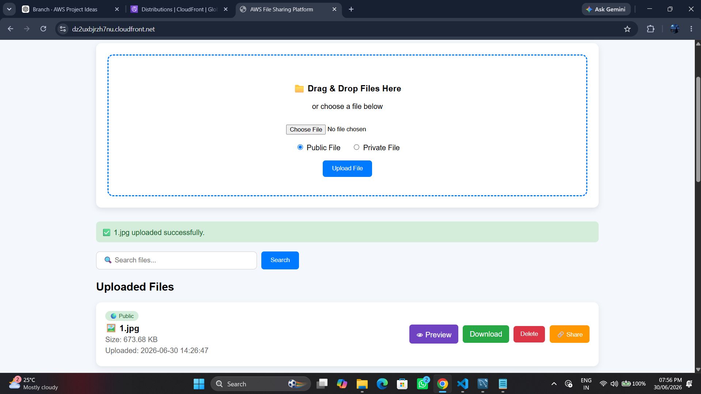
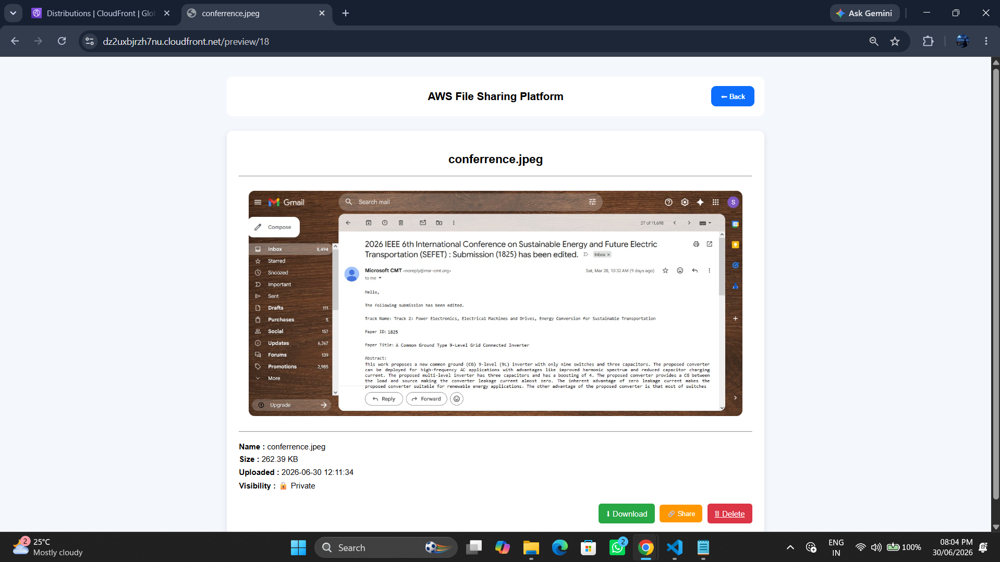
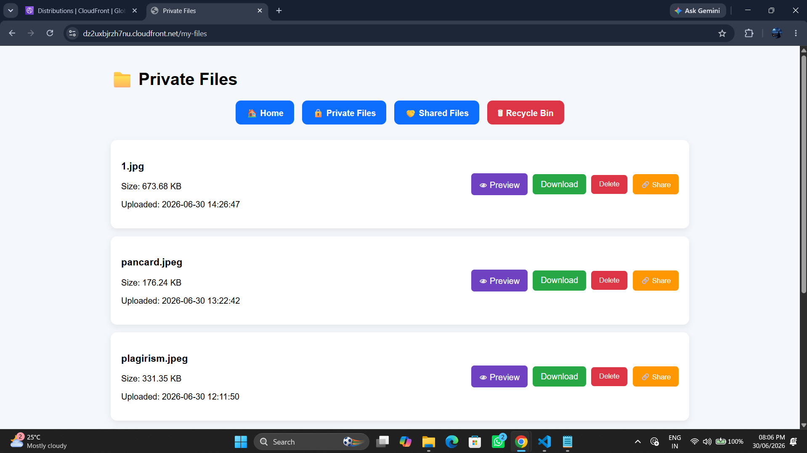

# 🚀 AWS File Sharing Platform

A secure cloud-based file sharing application built with **FastAPI** and deployed on **Amazon Web Services (AWS)**. The platform enables users to securely upload, preview, download, and share files using Amazon S3 while leveraging CloudFront for fast and secure content delivery.

---

<p align="center">

[![Live Demo]](https://dz2uxbjrzh7nu.cloudfront.net)

</p>

---

## 📸 Dashboard

<p align="center">
    
</p>


---

## 🌐 Live Demo

**Application:**  
https://dz2uxbjrzh7nu.cloudfront.net

---

# 📌 Features

- 🔐 User Registration & Login
- 👤 Secure Session Authentication
- ☁️ Upload Files to Amazon S3
- 🌍 Public & 🔒 Private File Uploads
- 📂 My Files Dashboard
- 🤝 Shared Files Dashboard
- 👀 File Preview
- ⬇️ File Download
- 🔗 Generate Shareable Links
- 🗑️ Soft Delete (Recycle Bin)
- 📊 File Size & Upload Date
- ⚡ CloudFront CDN Integration
- 🔒 HTTPS Support
- 📱 Responsive User Interface

---

# 🏗️ Architecture

```text
                    Users
                      │
                HTTPS (CloudFront)
                      │
                Nginx Reverse Proxy
                      │
                 FastAPI Backend
                 │             │
                 │             │
          Amazon RDS       Amazon S3
            (MySQL)            │
                               │
                    CloudFront CDN
```

---

# 🛠️ Tech Stack

## Backend

- FastAPI
- Python
- Jinja2 Templates
- Boto3
- BCrypt
- Session Middleware

## Frontend

- HTML5
- CSS3
- JavaScript

## Database

- Amazon RDS (MySQL)

## Cloud Services

- Amazon EC2
- Amazon S3
- Amazon CloudFront
- IAM Role

## Web Server

- Nginx

## Version Control

- Git
- GitHub

---

# 📂 Project Structure

```text
aws-file-sharing-platform/
│
├── backend/
│   ├── __init__.py
│   ├── main.py
│   ├── database.py
│   └── password_utils.py
│
├── static/
│   ├── style.css
│   └── script.js
│
├── templates/
│   ├── index.html
│   ├── login.html
│   ├── register.html
│   ├── preview.html
│   ├── my_files.html
│   ├── shared_files.html
│   └── ...
│
├── uploads/
├── requirements.txt
├── .gitignore
├── .env.example
└── README.md
```

---

# ✨ Features Overview

## Authentication

- User Registration
- Secure Login
- Password Hashing using BCrypt
- Session Management
- Logout

## File Management

- Upload Files
- Download Files
- Preview Images
- Preview PDFs
- Preview Videos
- Preview Audio
- Delete Files (Soft Delete)

## File Sharing

- Public Files
- Private Files
- Shared Files
- Shareable Links

---

# ☁️ AWS Services Used

| AWS Service | Purpose |
|-------------|---------|
| Amazon EC2 | Application Hosting |
| Amazon RDS | MySQL Database |
| Amazon S3 | File Storage |
| Amazon CloudFront | CDN & HTTPS |
| IAM Role | Secure AWS Access |

---

# 🔒 Security Features

- Password Hashing with BCrypt
- Session-based Authentication
- IAM Role Authentication
- Private Amazon S3 Bucket
- HTTPS via CloudFront
- Secure Database Connectivity

---

# 🚀 Installation

## Clone Repository

```bash
git clone https://github.com/manoj-konireddy/aws-file-sharing-platform.git
```

```bash
cd aws-file-sharing-platform
```

---

## Create Virtual Environment

### Windows

```bash
python -m venv venv
venv\Scripts\activate
```

### Linux

```bash
python3 -m venv venv
source venv/bin/activate
```

---

## Install Dependencies

```bash
pip install -r requirements.txt
```

---

## Configure Environment Variables

Create a `.env` file.

```env
DB_HOST=your_rds_endpoint
DB_USER=your_username
DB_PASSWORD=your_password
DB_NAME=file_sharing_db

S3_BUCKET=your_bucket_name
CLOUDFRONT_URL=your_cloudfront_distribution
```

---

## Run Application

```bash
uvicorn backend.main:app --reload
```

Application runs on:

```
http://127.0.0.1:8000
```

---

# 🚀 Deployment

The application is deployed using:

- Amazon EC2
- Nginx Reverse Proxy
- Systemd Service
- Amazon RDS (MySQL)
- Amazon S3
- Amazon CloudFront

---

# 📸 Screenshots

Add screenshots of:

- Home Page


- Login



- Register



- Upload Page



- File Preview




- My Files




---

# 📈 Future Enhancements

- Multiple File Upload
- Drag & Drop Upload
- Email Notifications
- Password Reset
- File Search
- User Profile
- Admin Dashboard
- File Versioning

---

# 👨‍💻 Author

**Konireddy Manoj Kumar Reddy**

GitHub:
https://github.com/manoj-konireddy

LinkedIn:
https://www.linkedin.com/in/manoj-konireddy

Portfolio:
https://d3mwy50w6wapyd.cloudfront.net/

---

# ⭐ If you like this project

If you found this project useful, please consider giving it a ⭐ on GitHub.

---

# 📄 License

This project is created for educational and portfolio purposes.